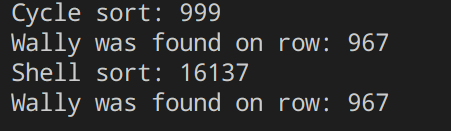

# Sorting Algorithms

## Cycle sort

For the first algorithm, I used is the cycle sort algorithm <br>

```
public string[] CycleSort(string[] input){
            int start = 0;
            this.counter = 0;

            for(int i = 0; i <= input.Length -2; i++){
                string item = input[i];

                int pos = i;

                for(int j = i + 1; j < input.Length; j++){
                    if(input[j].CompareTo(item) < 0){
                        pos++;
                    }
                }

                if(pos == i){continue;}

                while(item == input[pos]){
                    pos += 1;
                }

                if(pos != i){
                    string temp = item;
                    item = input[pos];
                    input[pos] = temp;
                    counter++;
                }


               while(pos != i){


                    pos = i;

                    for(int j = i + 1;j < input.Length; j++ ){
                        if(input[j].CompareTo(item) < 0){
                            pos += 1;
                        }
                    }

                   while(item.CompareTo(input[pos]) == 0){
                        pos += 1;
                    }

                    if(item.CompareTo(input[pos]) != 0){
                        string temp = item;
                        item = input[pos];
                        input[pos] = temp;
                        counter++;
                    }
                } 

            }
            return input;
}
```
The algorithm start by taking one element and moving it to the right location. We compare it with the other elements on the right to see where the correct location is.
If the position is found for the element we switch to it and start searching the position for the switched element. This algorithm uses minimal amount of memory writes, because the elements are placed imediatly in the correct position.

## Shell sort

The second algorithm I used is Shellsort. 

```
public string[] ShellSort(string[] input){

            this.counter = 0;
            
            for(int gap = input.Length/2; gap > 0; gap /= 2){

                for(int i = gap; i < input.Length; i++){

                    string temp = input[i];

                    int j;

                    for(j = i; j >= gap && input[j - gap].CompareTo(temp) > 0; j -= gap){
                        input[j] = input[j-gap];
                        counter++;
                    }

                    input[j] = temp;
                    counter++;
                }
            }
            return input;
        }
```

In this algorithm we compare the elements not with their neighbour. We start with calculating a gap, this is the distance from the elements we are goinging to compare. We take our element and compare it to one with the distance of the gap (i - gap). If they are not in the right place we switch them. We check all elements one by one on the right, if the left elements are, in this case because we want from A->Z, bigger we switch them. The gap gets smaller after each loop. When the gap gets 0 the elements are sorted.


## Finding Wally 

For finding Wally I made a class Search with a method SearchWally. this method will return the row where we find Wally. We use the binary search way to find it quick.

```
public int SearchWally(string[] input){

            string Wally = "Wally";

            int low = 0, high = input.Length - 1;

            while(low <= high){
                int mid = (low + high) / 2;

                if(input[mid].CompareTo(Wally) == 0){
                    return mid;
                }
                else if(Wally.CompareTo(input[mid]) < 0){
                    high = mid - 1;
                }
                else{
                    low = mid + 1;
                }
            }

            return -1;
        }
```

## Compare Cycle sort vs Shell sort



We see that the first one, the Cycle sort has less writes to memory than Shell sort. However this will not make it slower than Cycle sort.

Cycle sort has a time complexity of O(n) and the Shell sort has one of O(n log(n)). With this data we can say that the Shell sort mostly will be the quickest, however in some cases with small data Cycle sort can be quicker.